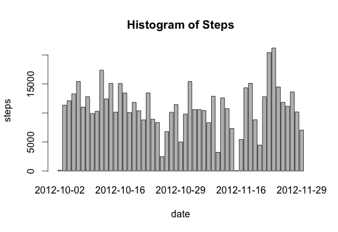
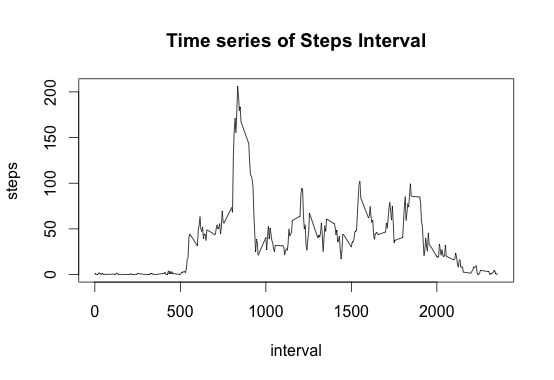
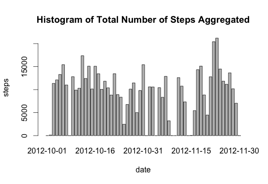
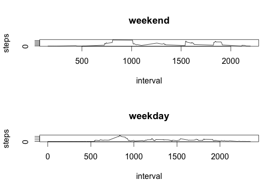

# Reproducible Research: Peer Assessment 1

## Loading and preprocessing the data
The dataset was downloaded from the assignment webpage to my localhost. I loaded the data using RStudio and the following code:
<code>
data <- read.csv("Localhost/DataScience/Reproducible_Research/Peer_Assessment1/activity.csv")

str(data)

'data.frame':        17568 obs. of  3 variables:
 $ steps   : int  NA NA NA NA NA NA NA NA NA NA ...
 $ date    : Factor w/ 61 levels "2012-10-01","2012-10-02",..: 1 1 1 1 1 1 1 1 1 1 ...
 $ interval: int  0 5 10 15 20 25 30 35 40 45 ...
</code>

## What is mean total number of steps taken per day?
### Histogram of Steps
I first had to omit the missing values before making any calculations:
<code>
> steps <- na.omit(data)
> head(data)

steps       date interval
289     0 2012-10-02        0
290     0 2012-10-02        5
291     0 2012-10-02       10
292     0 2012-10-02       15
293     0 2012-10-02       20
294     0 2012-10-02       25
</code>
I then subsetted the steps and aggregated the data with the following code:
<code>
> steps.date <- aggregate(steps ~ date, data = data, FUN = sum)

> head(steps.date)
        date steps
1 2012-10-02   126
2 2012-10-03 11352
3 2012-10-04 12116
4 2012-10-05 13294
5 2012-10-06 15420
6 2012-10-07 11015
</code>

To create the histogram I ran the following code:

<code>
> barplot(steps.date$steps, names.arg = steps.date$date, xlab = "date", ylab = "steps", main = paste("Histogram of", xname))
</code>

### Mean
In order to calculate the mean number of steps I ran the following code:
<code>
> mean(steps.date$steps)
[1] 10766.19
</code>

### Median
In order to calculate the mean number of steps I ran the following code:
<code>
> median(steps.date$steps)
[1] 10765
</code>

## What is the average daily activity pattern?
1. I had to calculate and plot the 5-minute intervals and number of steps taken. I first subsetted and aggregated the steps and intervals:

<code>
> steps.interval <- aggregate(steps ~ interval, data = data, FUN = mean)

> head(steps.interval)
  interval     steps
1        0 1.7169811
2        5 0.3396226
3       10 0.1320755
4       15 0.1509434
5       20 0.0754717
6       25 2.0943396
</code>

I then plotted the data with the following code:
<code>
> plot(steps.interval, type="l", main = paste("Time series of Steps Interval"))
</code>

2. To calculate the 5-minute interval with the most amount of steps I ran this code:
<code>
> steps.interval$interval[which.max(steps.interval$steps)]
[1] 835
</code>
## Imputing missing values
1. To calculate the total number of missing values (NAs) in the dataset I ran the following code:

<code>
> sum(is.na(data))
[1] 2304
</code>

2. To fill in the missing values in the dataset I ran the following code:
<code>
> data[is.na(data)] <- 0
> head(data)
  steps       date interval
1     0 2012-10-01        0
2     0 2012-10-01        5
3     0 2012-10-01       10
4     0 2012-10-01       15
5     0 2012-10-01       20
6     0 2012-10-01       25
</code>

2. To replace the missing values and create a new dataset I ran the following code:
<code>
> new.data <- merge(data, steps.interval, by = "interval", suffixes = c("",                                               ".y"))
> nas <- is.na(new.data$steps)
> new.data$steps[nas] <- new.data$steps.y[nas]
> new.data <- new.data[, c(1:3)]
</code>

3.1. To make a histogram of the total number of steps taken each day, I ran this code:
<code>
> steps.date <- aggregate(steps ~ date, data = activity, FUN = sum)
> barplot(steps.date$steps, names.arg = steps.date$date, xlab = "date", ylab = "steps", main = paste("Histogram of Total Number of Steps Aggregated"))
</code>

3.2. Mean
<code>
> mean(steps.date$steps)
[1] 9354.23
</code>

3.3. Median
<code>
median(steps.date$steps)
[1] 10395
</code>

## Are there differences in activity patterns between weekdays and weekends?

1. Create a new factor variable in the dataset with two levels -- "weekday" and "weekend" indicating whether a given date is a weekday or weekend day.

<code>
daytype <- function(date) {
    if (weekdays(as.Date(date)) %in% c("Saturday", "Sunday")) {
        "weekend"
    } else {
        "weekday"
    }
}
data$daytype <- as.factor(sapply(data$date, daytype))
</code>

2. Make a panel plot containing a time series plot (i.e. type = "l") of the 5-minute interval (x-axis) and the average number of steps taken, averaged across all weekday days or weekend days (y-axis).

<code>
par(mfrow = c(2, 1))
for (type in c("weekend", "weekday")) {
    steps.type <- aggregate(steps ~ interval, data = activity, subset = data$daytype == 
        type, FUN = mean)
    plot(steps.type, type = "l", main = type)
}
</code>

